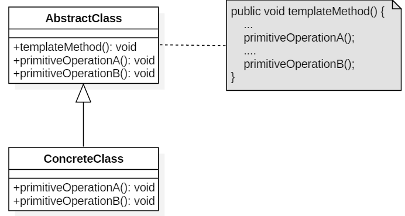
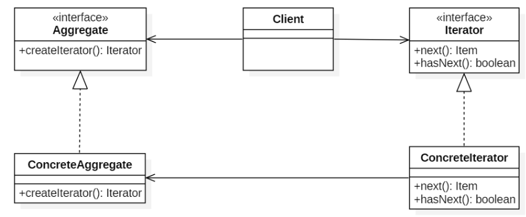
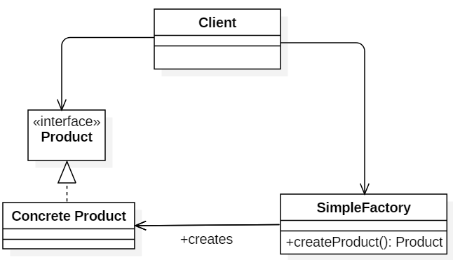
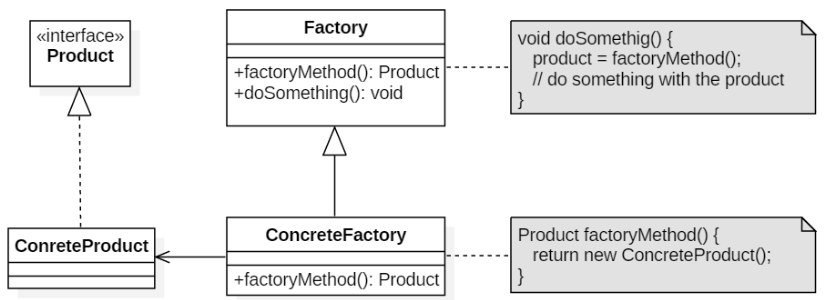
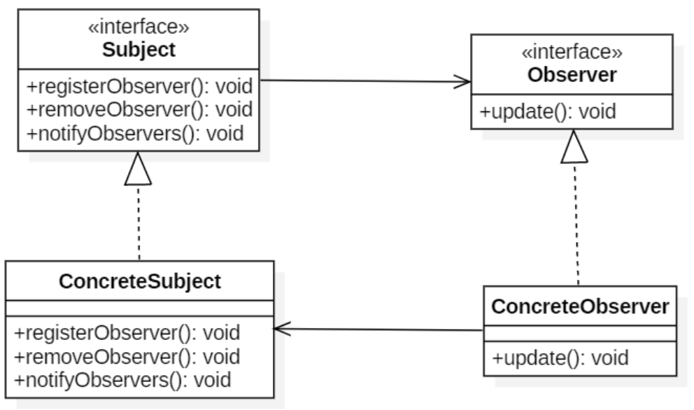
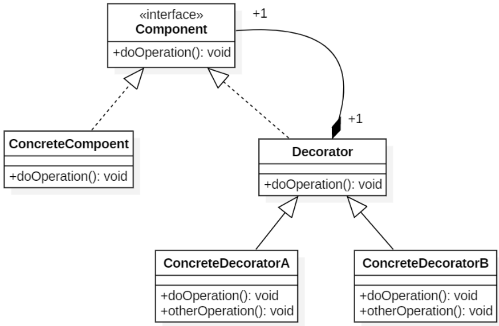

67了解常用设计模式及其应用场景、示例

- [x] 面向对象的六个基本原则
- [x] 单例模式（手撕各种单例模式）
- [x] 工厂模式（Spring的BeanFactory,ApplicationContext）vs.抽象工厂模式
- [x] 构造器模式（应用场景：解决构造复杂对象的麻烦。复杂：需要输入的参数的组合较多）
- [x] 代理模式（Spring AOP(动态代理模式：2种实现方式，即jdk & 字节码方式cglib）
- [x] 装饰器模式
- [x] 观察者模式（各种事件监听器）
- [x] 策略模式（比较器Comparator）
- [x] 迭代器模式（ArrayList等集合框架中的迭代器）
- [ ] 生产者消费者模式（消息队列）要能手撕
- [ ] [Spring中涉及到哪些设计模式？](https://juejin.im/post/5ce69379e51d455d877e0ca0)

# 为什么要学习设计模式？

设计模式来源众多专家的智慧和经验，是从许多优秀的软件系统中总结出的成功的、能够实现可维护性复用的设计方案，使用这些方案可以让我们避免做一些重复性的工作。

随着需求的变化，代码改动过大的原因是什么？

学习新的**设计模式**来重构我们的代码。前人根据自己的经验总结出来的，代表了代码设计的最佳实践。

# 六大原则

一、开闭原则

>  一个软件实体应该对扩展开发，对修改关闭。即软件实体应尽量在不修改原有代码情况下进行扩展

**优点：实践开闭原则的优点在于可以在不改动原有代码的前提下给程序扩展功能。增加了程序的可扩展性，同时也降低了程序的维护成本。**

二、里式替换原则

> 所有引用基类对象的地方能够透明地使用其子类的对象

三、依赖倒置原则

> 抽象不应该依赖于具体类，具体类应当依赖于抽象。换言之，要针对接口编程，而不是针对实现编程。

**优点：通过抽象来搭建框架，建立类和类的关联，以减少类间的耦合性。而且以抽象搭建的系统要比以具体实现搭建的系统更加稳定，扩展性更高，同时也便于维护。**

四、单一职责原则

> 一个类只负责一个功能领域中的相应职责，或者可以定义为：就一个类而言，应该只有一个引起它变化的原因

单一职责原则告诉我们：一个类不能太“累”！在软件系统中，一个类（大到模块，小到方法）承担的职责越多，它被复用的可能性就越小，而且一个类承担的职责过多，就相当于将这些职责耦合在一起，当其中一个职责变化时，可能会影响其他职责的运作，因此要将这些职责进行分离，将不同的职责封装在不同的类中，即将不同的变化原因封装在不同的类中，如果多个职责总是同时发生改变则可将它们封装在同一类中。

单一职责原则是实现高内聚、低耦合的指导方针，它是最简单但又最难运用的原则，需要设计人员发现类的不同职责并将其分离，而发现类的多重职责需要设计人员具有较强的分析设计能力和相关实践经验。

五、迪米特法则

> 一个软件实体应当尽可能少地与其他实体发生作用

如果一个系统符合迪米特法则，那么当其中某一个模块发生修改时，就会尽量少地影响其他模块，扩展会相对容易，这是对软件实体之间通信的限制，迪米特法则要求限制软件实体之间通信的宽度和深度。迪米特法则可降低系统的耦合度，使类与类之间保持松散的耦合关系。

迪米特法则要求我们在设计系统时，应该尽量减少对象之间的交互，如果两个对象之间不必彼此直接通信，那么这两个对象就不应当发生任何直接的相互作用，如果其中的一个对象需要调用另一个对象的某一个方法的话，可以通过第三者转发这个调用。简言之，就是通过引入一个合理的第三者来降低现有对象之间的耦合度。

在将迪米特法则运用到系统设计中时，要注意下面的几点：在类的划分上，应当尽量创建松耦合的类，类之间的耦合度越低，就越有利于复用，一个处在松耦合中的类一旦被修改，不会对关联的类造成太大波及。在类的结构设计上，每一个类都应当尽量降低其成员变量和成员函数的访问权限。在类的设计上，只要有可能，一个类型应当设计成不变类。在对其他类的引用上，一个对象对其他对象的引用应当降到最低。

**优点：实践迪米特法则可以良好地降低类与类之间的耦合，减少类与类之间的关联程度，让类与类之间的协作更加直接。**

六、接口分离原则

> 使用多个专门的接口，而不使用单一的总接口，即客户端不应该依赖那些它不需要的接口。

## 六大原则学习心得

六大原则中，**开闭原则**、**里氏替换原则**、**依赖倒置原则** 联系比较紧密，后两者是实现开闭原则重要前提，使用中通过抽象化设计具有很好的可拓展性和可维护性。

**知道最少原则** 可以降低耦合，减少不必要的交互，主张设计接口和类要简单易使用，将复杂的逻辑封装并提供简单易用的接口。

**单一职责原则** 使项目中的类和方法根据职责细分，避免单个类负担过重。职责越多，被复用的可能性就越小或使用起来越麻烦。

**接口分离原则** 将功能复杂的接口细分成多个特定功能的接口，只做该做的事情，降低耦合，但是细化粒度不能太细，容易导致接口过多。单一职责原则强调单个类内部根据职责细分的设计，接口分离原则强调类之间的耦合，尽量建立最小的依赖关系。

# 单例模式

> 单例模式确保一个类只有一个实例，并提供一个访问它的全局访问点

## 懒汉模式——线程不安全

以下实现中，私有静态变量 uniqueInstance 被延迟实例化，这样做的好处是，如果没有用到该类，那么就不会实例化 uniqueInstance，从而节约资源。

这个实现在多线程环境下是**不安全**的，如果多个线程能够同时进入 `if (uniqueInstance == null)` ，并且此时 uniqueInstance 为 null，那么会有多个线程执行 `uniqueInstance = new Singleton();` 语句，这将导致实例化多次 uniqueInstance。

~~~java
public class Singleton {
    private Singleton(){};
    private static Singleton instance;

    public static Singleton getInstance(){
        if(instance==null){
            instance=new Singleton();
        }
        return instance;
    }
}
~~~

## 饿汉模式——线程安全

线程不安全问题主要是由于 uniqueInstance 被实例化多次，采取直接实例化 uniqueInstance 的方式就不会产生线程不安全问题。

但是直接实例化的方式也丢失了延迟实例化带来的节约资源的好处。

~~~java
class LazySingleton {
    private LazySingleton(){};
    private static LazySingleton instance=new LazySingleton();

    public static LazySingleton getInstance(){
        return instance;
    }
}
~~~

## 懒汉式——线程安全

只需要对 getUniqueInstance() 方法加锁，那么在一个时间点只能有一个线程能够进入该方法，从而避免了实例化多次 uniqueInstance。

但是当一个线程进入该方法之后，其它试图进入该方法的线程都必须等待，即使 uniqueInstance 已经被实例化了。这会让线程阻塞时间过长，因此该方法有性能问题，不推荐使用。

~~~java
public static synchronized Singleton getUniqueInstance() {
    if (uniqueInstance == null) {
        uniqueInstance = new Singleton();
    }
    return uniqueInstance;
}
~~~

## 双重校锁——保证线程安全

uniqueInstance 只需要被实例化一次，之后就可以直接使用了。加锁操作只需要对实例化那部分的代码进行，只有当 uniqueInstance 没有被实例化时，才需要进行加锁。

双重校验锁先判断 uniqueInstance 是否已经被实例化，如果没有被实例化，那么才对实例化语句进行加锁。

```java
public class Singleton {

    private volatile static Singleton uniqueInstance;

    private Singleton() {
    }

    public static Singleton getUniqueInstance() {
        if (uniqueInstance == null) {
            synchronized (Singleton.class) {
                if (uniqueInstance == null) {
                    uniqueInstance = new Singleton();
                }
            }
        }
        return uniqueInstance;
    }
}
```

考虑下面的实现，也就是**只使用了一个 if 语句**。在 uniqueInstance == null 的情况下，如果两个线程都执行了 if 语句，那么两个线程都会进入 if 语句块内。虽然在 if 语句块内有加锁操作，但是两个线程都会执行 `uniqueInstance = new Singleton();` 这条语句，只是先后的问题，那么就会进行两次实例化。因此必须使用双重校验锁，也就是需要使用两个 if 语句：第一个 if 语句用来避免 uniqueInstance 已经被实例化之后的加锁操作，而第二个 if 语句进行了加锁，所以只能有一个线程进入，就不会出现 uniqueInstance == null 时两个线程同时进行实例化操作。

uniqueInstance 采用 **volatile** 关键字修饰也是很有必要的， `uniqueInstance = new Singleton();` 这段代码其实是分为三步执行：

1. 为 uniqueInstance 分配内存空间
2. 初始化 uniqueInstance
3. 将 uniqueInstance 指向分配的内存地址

但是由于 JVM 具有指令重排的特性，执行顺序有可能变成 1>3>2。指令重排在单线程环境下不会出现问题，但是在多线程环境下会导致一个线程获得还没有初始化的实例。例如，线程 T1 执行了 1 和 3，此时 T2 调用 getUniqueInstance() 后发现 uniqueInstance 不为空，因此返回 uniqueInstance，但此时 uniqueInstance 还未被初始化。

使用 volatile 可以禁止 JVM 的指令重排，保证在多线程环境下也能正常运行。

## 静态内部类实现

当 Singleton 类被加载时，静态内部类 SingletonHolder 没有被加载进内存。只有当调用 `getUniqueInstance()` 方法从而触发 `SingletonHolder.INSTANCE` 时 SingletonHolder 才会被加载，此时初始化 INSTANCE 实例，并且 JVM 能确保 INSTANCE 只被实例化一次。

这种方式不仅具有延迟初始化的好处，而且由 JVM 提供了对线程安全的支持。

```java
public class Singleton {

    private Singleton() {
    }

    private static class SingletonHolder {
        private static final Singleton INSTANCE = new Singleton();
    }

    public static Singleton getUniqueInstance() {
        return SingletonHolder.INSTANCE;
    }
}
```

## 枚举实现

~~~java
public enum EnumSingleton{
    INSTANCE;
    private String objName;


    public String getObjName() {
        return objName;
    }


    public void setObjName(String objName) {
        this.objName = objName;
    }

    public static void main(String[] args) {
        EnumSingleton first=EnumSingleton.INSTANCE;
        first.setObjName("first");
        System.out.println(first.getObjName());
        EnumSingleton second=EnumSingleton.INSTANCE;
        second.setObjName("second");
        System.out.println(second.getObjName());
        System.out.println(first.getObjName());
        System.out.println(second.getObjName());
        try{
            EnumSingleton[] s=EnumSingleton.class.getEnumConstants();
            for(EnumSingleton enumSingleton:s){
                System.out.println(enumSingleton.getObjName());
            }
        }catch(Exception e){
            e.printStackTrace();
        }
    }
}
~~~

该实现可以防止反射攻击。在其它实现中，通过 setAccessible() 方法可以将私有构造函数的访问级别设置为 public，然后调用构造函数从而实例化对象，如果要防止这种攻击，需要在构造函数中添加防止多次实例化的代码。该实现是由 JVM 保证只会实例化一次，因此不会出现上述的反射攻击。

该实现在多次序列化和序列化之后，不会得到多个实例。而其它实现需要使用 transient 修饰所有字段，并且实现序列化和反序列化的方法。

## Examples

- Logger Classes
- Configuration Classes
- Accesing resources in shared mode
- Factories implemented as Singletons

# 策略模式

定义一系列算法，封装每个算法，并使它们可以相互交换


由Strategy接口来定义一个算法族，它们都实现了behavior()方法

Context是使用该算法族的类，其中的doSomething()方法会调用behavior()，setStrategy(Strategy)方法可以动态地改变Strategy对象，可以动态改变Context使用的算法

## 实现

设计一个鸭子，它可以动态地改变叫声。这里的算法族是鸭子的叫声行为。

```java
public interface QuackBehavior {
    void quack();
}
public class Quack implements QuackBehavior {
    @Override
    public void quack() {
        System.out.println("quack!");
    }
}
public class Squeak implements QuackBehavior{
    @Override
    public void quack() {
        System.out.println("squeak!");
    }
}
public class Duck {

    private QuackBehavior quackBehavior;

    public void performQuack() {
        if (quackBehavior != null) {
            quackBehavior.quack();
        }
    }

    public void setQuackBehavior(QuackBehavior quackBehavior) {
        this.quackBehavior = quackBehavior;
    }
}
public class Client {

    public static void main(String[] args) {
        Duck duck = new Duck();
        duck.setQuackBehavior(new Squeak());
        duck.performQuack();
        duck.setQuackBehavior(new Quack());
        duck.performQuack();
    }
}
```

## Examples

- java.util.Comparator#compare()
- javax.servlet.http.HttpServlet
- javax.servlet.Filter#doFilter()

# 模板方法

定义**算法框架**，并将一些步骤的实现延迟到子类中。通过模板方法，子类可以重新定义算法的某些步骤，而不用改变算法的结构。



## 实现

例如冲咖啡和泡茶都有类似的流程，但是某些步骤上会有点不一样，要求复用那些相同步骤的代码。

```java
public abstract class CaffeineBeverage {
    final void prepareRecipe() {
        boilWater();
        brew();
        pourInCup();
        addCondiments();
    }

    abstract void brew();

    abstract void addCondiments();

    void boilWater() {
        System.out.println("boilWater");
    }

    void pourInCup() {
        System.out.println("pourInCup");
    }
}
public class Coffee extends CaffeineBeverage {
    @Override
    void brew() {
        System.out.println("Coffee.brew");
    }

    @Override
    void addCondiments() {
        System.out.println("Coffee.addCondiments");
    }
}
public class Tea extends CaffeineBeverage {
    @Override
    void brew() {
        System.out.println("Tea.brew");
    }

    @Override
    void addCondiments() {
        System.out.println("Tea.addCondiments");
    }
}
public class Client {
    public static void main(String[] args) {
        CaffeineBeverage caffeineBeverage = new Coffee();
        caffeineBeverage.prepareRecipe();
        System.out.println("-----------");
        caffeineBeverage = new Tea();
        caffeineBeverage.prepareRecipe();
    }
}
```

## Examples

- java.util.Collections#sort()
- java.io.InputStream#skip()
- java.io.InputStream#read()
- java.util.AbstractList#indexOf()

# 迭代器模式

提供一种顺序访问聚合对象元素的方法，并且不暴露聚合对象的内部表示

- 抽象容器Aggregate 是聚合类，其中 createIterator() 方法可以产生一个 Iterator；
- 抽象迭代器Iterator 主要定义了 hasNext() 和 next() 方法。迭代器实现：实现迭代器接口中定义的方法，完成集合的迭代。
- Client 组合了 Aggregate，为了迭代遍历 Aggregate，也需要组合 Iterator



## 实现

```java
public interface Aggregate {
    Iterator createIterator();
}
public interface Iterator<Item> {

    Item next();

    boolean hasNext();
}
//实现具体的迭代器，描述迭代器的行为
public class ConcreteIterator<Item> implements Iterator {

    private Item[] items;
    private int position = 0;

    public ConcreteIterator(Item[] items) {
        this.items = items;
    }

    @Override
    public Object next() {
        return items[position++];
    }

    @Override
    public boolean hasNext() {
        return position < items.length;
    }
}
public class ConcreteAggregate implements Aggregate {

    private Integer[] items;

    public ConcreteAggregate() {
        items = new Integer[10];
        for (int i = 0; i < items.length; i++) {
            items[i] = i;
        }
    }

    @Override
    public Iterator createIterator() {
        return new ConcreteIterator<Integer>(items);
    }
}
public class Client {

    public static void main(String[] args) {
        Aggregate aggregate = new ConcreteAggregate();
        Iterator<Integer> iterator = aggregate.createIterator();
        while (iterator.hasNext()) {
            System.out.println(iterator.next());
        }
    }
}
```

## Examples

- java.util.Iterator
- java.util.Enumeration

# 各种工厂

## 简单工厂模式

在创建一个对象时不向客户暴露内部细节，并提供一个创建对象的通用接口。

简单工厂把实例化的操作单独放到一个类中，这个类就成为简单工厂类，**让简单工厂类来决定应该用哪个具体子类来实例化。**

这样做能把客户类和具体子类的实现解耦，客户类不再需要知道有哪些子类以及应当实例化哪个子类。客户类往往有多个，如果不使用简单工厂，那么所有的客户类都要知道所有子类的细节。而且一旦子类发生改变，例如增加子类，那么所有的客户类都要进行修改。



### 实现

```java
public interface Product {
}
public class ConcreteProduct implements Product {
}
public class ConcreteProduct1 implements Product {
}
public class ConcreteProduct2 implements Product {
}

//错误的使用方式
public class Client {

    public static void main(String[] args) {
        int type = 1;
        Product product;
        if (type == 1) {
            product = new ConcreteProduct1();
        } else if (type == 2) {
            product = new ConcreteProduct2();
        } else {
            product = new ConcreteProduct();
        }
        // do something with the product
    }
}
//简单工厂模式
public class SimpleFactory {
    public Product createProduct(int type) {
        if (type == 1) {
            return new ConcreteProduct1();
        } else if (type == 2) {
            return new ConcreteProduct2();
        }
        return new ConcreteProduct();
    }
}
public class Client {

    public static void main(String[] args) {
        SimpleFactory simpleFactory = new SimpleFactory();
        Product product = simpleFactory.createProduct(1);
        // do something with the product
    }
}
```

## 工厂方法

定义了一个创建对象的接口，由子类决定要实例化哪个类。工厂方法把实例化操作推迟到子类中。

在简单工厂中，创建对象的是另一个类，而在工厂方法中，是由子类来创建对象。

下图中，Factory 有一个 doSomething() 方法，这个方法需要用到一个产品对象，这个产品对象由 factoryMethod() 方法创建。该方法是抽象的，需要由子类去实现。



### 实现

```java
public abstract class Factory {
    abstract public Product factoryMethod();
    public void doSomething() {
        Product product = factoryMethod();
        // do something with the product
    }
}
public class ConcreteFactory extends Factory {
    public Product factoryMethod() {
        return new ConcreteProduct();
    }
}
public class ConcreteFactory1 extends Factory {
    public Product factoryMethod() {
        return new ConcreteProduct1();
    }
}
public class ConcreteFactory2 extends Factory {
    public Product factoryMethod() {
        return new ConcreteProduct2();
    }
}
```

### Examples

- java.util.Calender
- java.util.ResourceBundle
- java.text.NumberFormat
- java.nio.charset.Charset
- java.net.URLStreamHandlerFactory
- javax.xml.bind.JAXBContext

## 抽象工厂

提供一个接口，用于创建相关的对象家族。

抽象工厂模式创建的是对象家族，也就是很多对象而不是一个对象，并且这些对象是相关的，也就是说必须一起创建出来。而工厂方法模式只是用于创建一个对象，这和抽象工厂模式有很大不同。

抽象工厂模式用到了工厂方法模式来创建单一对象，AbstractFactory 中的 createProductA() 和 createProductB() 方法都是让子类来实现，这两个方法单独来看就是在创建一个对象，这符合工厂方法模式的定义。

至于创建对象的家族这一概念是在 Client 体现，Client 要通过 AbstractFactory 同时调用两个方法来创建出两个对象，在这里这两个对象就有很大的相关性，Client 需要同时创建出这两个对象。

从高层次来看，抽象工厂使用了组合，即 Cilent 组合了 AbstractFactory，而工厂方法模式使用了继承。

```java
public class AbstractProductA {
}
public class AbstractProductB {
}
public class ProductA1 extends AbstractProductA {
}
public class ProductA2 extends AbstractProductA {
}
public class ProductB1 extends AbstractProductB {
}
public class ProductB2 extends AbstractProductB {
}
public abstract class AbstractFactory {
    abstract AbstractProductA createProductA();
    abstract AbstractProductB createProductB();
}
public class ConcreteFactory1 extends AbstractFactory {
    AbstractProductA createProductA() {
        return new ProductA1();
    }

    AbstractProductB createProductB() {
        return new ProductB1();
    }
}
public class ConcreteFactory2 extends AbstractFactory {
    AbstractProductA createProductA() {
        return new ProductA2();
    }

    AbstractProductB createProductB() {
        return new ProductB2();
    }
}
public class Client {
    public static void main(String[] args) {
        AbstractFactory abstractFactory = new ConcreteFactory1();
        AbstractProductA productA = abstractFactory.createProductA();
        AbstractProductB productB = abstractFactory.createProductB();
        // do something with productA and productB
    }
}
```

### Examples

- [javax.xml.parsers.DocumentBuilderFactory](http://docs.oracle.com/javase/8/docs/api/javax/xml/parsers/DocumentBuilderFactory.html)
- [javax.xml.transform.TransformerFactory](http://docs.oracle.com/javase/8/docs/api/javax/xml/transform/TransformerFactory.html#newInstance--)
- [javax.xml.xpath.XPathFactory](http://docs.oracle.com/javase/8/docs/api/javax/xml/xpath/XPathFactory.html#newInstance--)

# 观察者模式

定义对象之间的一对多依赖，当一个对象状态改变时，它的所有依赖都会收到通知并且自动更新状态。

主题（Subject）是被观察的对象，而其所有依赖者（Observer）称为观察者。



主题（Subject）具有注册和移除观察者、并通知所有观察者的功能，主题是通过维护一张观察者列表来实现这些操作的。

观察者（Observer）的注册功能需要调用主题的 registerObserver() 方法。

## 实现

```java
public interface Subject {
    void registerObserver(Observer o);

    void removeObserver(Observer o);

    void notifyObserver();
}
public class WeatherData implements Subject {
    private List<Observer> observers;
    private float temperature;
    private float humidity;
    private float pressure;

    public WeatherData() {
        observers = new ArrayList<>();
    }

    public void setMeasurements(float temperature, float humidity, float pressure) {
        this.temperature = temperature;
        this.humidity = humidity;
        this.pressure = pressure;
        notifyObserver();
    }

    @Override
    public void registerObserver(Observer o) {
        observers.add(o);
    }

    @Override
    public void removeObserver(Observer o) {
        int i = observers.indexOf(o);
        if (i >= 0) {
            observers.remove(i);
        }
    }

    @Override
    public void notifyObserver() {
        for (Observer o : observers) {
            o.update(temperature, humidity, pressure);
        }
    }
}
public interface Observer {
    void update(float temp, float humidity, float pressure);
}
public class StatisticsDisplay implements Observer {

    public StatisticsDisplay(Subject weatherData) {
        weatherData.reisterObserver(this);
    }

    @Override
    public void update(float temp, float humidity, float pressure) {
        System.out.println("StatisticsDisplay.update: " + temp + " " + humidity + " " + pressure);
    }
}
public class CurrentConditionsDisplay implements Observer {

    public CurrentConditionsDisplay(Subject weatherData) {
        weatherData.registerObserver(this);
    }

    @Override
    public void update(float temp, float humidity, float pressure) {
        System.out.println("CurrentConditionsDisplay.update: " + temp + " " + humidity + " " + pressure);
    }
}
public class WeatherStation {
    public static void main(String[] args) {
        WeatherData weatherData = new WeatherData();
        CurrentConditionsDisplay currentConditionsDisplay = new CurrentConditionsDisplay(weatherData);
        StatisticsDisplay statisticsDisplay = new StatisticsDisplay(weatherData);

        weatherData.setMeasurements(0, 0, 0);
        weatherData.setMeasurements(1, 1, 1);
    }
}
```

~~~
CurrentConditionsDisplay.update: 0.0 0.0 0.0
StatisticsDisplay.update: 0.0 0.0 0.0
CurrentConditionsDisplay.update: 1.0 1.0 1.0
StatisticsDisplay.update: 1.0 1.0 1.0
~~~

## JDK

- [java.util.Observer](http://docs.oracle.com/javase/8/docs/api/java/util/Observer.html)
- [java.util.EventListener](http://docs.oracle.com/javase/8/docs/api/java/util/EventListener.html)
- [javax.servlet.http.HttpSessionBindingListener](http://docs.oracle.com/javaee/7/api/javax/servlet/http/HttpSessionBindingListener.html)
- [RxJava](https://github.com/ReactiveX/RxJava)

# 装饰器模式

`装饰器模式（Decorator）`,动态地给一个对象添加一些额外的职责，就增加功能来说，装饰器模式比生成子类更为灵活；它允许向一个现有的对象添加新的功能，同时又不改变其结构。

- 抽象装饰器和具体被装饰的对象实现同一个接口
- 抽象装饰器里面要持有接口对象，以便请求传递
- 具体装饰器覆盖抽象装饰器方法并用super进行调用，传递请求



 优点

- 装饰类和被装饰类都只关心自身的核心业务，实现了解耦。
- 方便动态的扩展功能，且提供了比继承更多的灵活性。

缺点

- 如果功能扩展过多，势必产生大量的类。
- 多层装饰比较复杂。

## 实现

```java
public interface Beverage {
    double cost();
}
public class DarkRoast implements Beverage {
    @Override
    public double cost() {
        return 1;
    }
}
public class HouseBlend implements Beverage {
    @Override
    public double cost() {
        return 1;
    }
}
public abstract class CondimentDecorator implements Beverage {
    protected Beverage beverage;
}
public class Milk extends CondimentDecorator {

    public Milk(Beverage beverage) {
        this.beverage = beverage;
    }

    @Override
    public double cost() {
        return 1 + beverage.cost();
    }
}
public class Mocha extends CondimentDecorator {

    public Mocha(Beverage beverage) {
        this.beverage = beverage;
    }

    @Override
    public double cost() {
        return 1 + beverage.cost();
    }
}
public class Client {

    public static void main(String[] args) {
        Beverage beverage = new HouseBlend();
        beverage = new Mocha(beverage);
        beverage = new Milk(beverage);
        System.out.println(beverage.cost());
    }
}
```

## Examples

应用场景：若想对一个类从不同角度进行功能扩展，例如java.io中，InputStream是一个抽象类，标准类库中提供了FileInputStream\ByteArrayInputStream等各种不同的子类，分别从不同角度对InputStream进行了功能扩展。这些不同的实现类其构造函数的输入均为InputStream（的实现类），然后对InputStream添加不同层次的逻辑，从而实现不同的功能，这就是装饰。

- java.io.BufferedInputStream(InputStream)
- java.io.DataInputStream(InputStream)
- java.io.BufferedOutputStream(OutputStream)
- java.util.zip.ZipOutputStream(OutputStream)
- java.util.Collections#checked[List|Map|Set|SortedSet|SortedMap](https://github.com/CyC2018/CS-Notes/blob/master/notes)

# 代理模式

控制对其它对象的访问，也就是对目标对象另外的访问方式，通过代理对象来访问目标对象。这样做的好处就是可以在目标对象实现的基础上，增强额外的功能操作，即扩展目标对象的功能。

代理有以下四类：

- 远程代理（Remote Proxy）：控制对远程对象（不同地址空间）的访问，它负责将请求及其参数进行编码，并向不同地址空间中的对象发送已经编码的请求。
- 虚拟代理（Virtual Proxy）：根据需要创建开销很大的对象，它可以缓存实体的附加信息，以便延迟对它的访问，例如在网站加载一个很大图片时，不能马上完成，可以用虚拟代理缓存图片的大小信息，然后生成一张临时图片代替原始图片。
- 保护代理（Protection Proxy）：按权限控制对象的访问，它负责检查调用者是否具有实现一个请求所必须的访问权限。
- 智能代理（Smart Reference）：取代了简单的指针，它在访问对象时执行一些附加操作：记录对象的引用次数；当第一次引用一个对象时，将它装入内存；在访问一个实际对象前，检查是否已经锁定了它，以确保其它对象不能改变它。

## 静态代理

静态代理在使用时,需要定义接口或者父类,被代理对象与代理对象一起实现相同的接口或者是继承相同父类.

**关键：在编译期确定代理对象，在程序运行前代理类的.class文件就已经存在了。**

缺点：因为代理对象需要与目标对象实现一样的接口，所有会有很多代理类，类太多。同时，一旦接口增加方法，目标对象与代理对象都需要维护。

~~~java
public interface IUserDao {
    void save();
}
public class UserDao implements IUserDao {
    public void save() {
        System.out.println("----已经保存数据!----");
    }
}
public class UserDaoProxy implements IUserDao{
    //接收保存目标对象
    private IUserDao target;
    public UserDaoProxy(IUserDao target){
        this.target=target;
    }

    public void save() {
        System.out.println("开始事务...");
        target.save();//执行目标对象的方法
        System.out.println("提交事务...");
    }
}
public class App {
    public static void main(String[] args) {
        //目标对象
        UserDao target = new UserDao();

        //代理对象,把目标对象传给代理对象,建立代理关系
        UserDaoProxy proxy = new UserDaoProxy(target);

        proxy.save();//执行的是代理的方法
    }
}
~~~

## 动态代理

1. 在运行期，通过**反射机制**创建一个实现了一组给定接口的新类
2. 在运行时生成的class，必须提供一组interface给它。然后该class就宣称它实现了这些 interface。该class的实例可以当作这些interface中的任何一个来用。但是这个Dynamic Proxy其实就是一个Proxy， 它不会替你作实质性的工作，在生成它的实例时你必须提供一个handler，由它接管实际的工作。
3. 动态代理也叫做:JDK代理,接口代理
4. 接口中声明的所有方法都被转移到调用处理器一个集中的方法中处理（InvocationHandler.invoke）。这样，在接口方法数量比较多的时候，我们可以进行灵活处理，而不需要像静态代理那样每一个方法进行中转。而且动态代理的应用使我们的类职责更加单一，复用性更强

**JDK中生成代理对象的API**

代理类所在包:java.lang.reflect.Proxy

JDK实现代理只需要使用**newProxyInstance**方法,但是该方法需要接收三个参数,完整的写法是:

```java
static Object newProxyInstance(ClassLoader loader, Class [] interfaces, InvocationHandler handler)
```

注意该方法是在Proxy类中是静态方法,且接收的三个参数依次为:

- ClassLoader loader:指定当前目标对象使用类加载器,用null表示默认类加载器
- Class [] interfaces:需要实现的接口数组
- InvocationHandler handler:调用处理器,执行目标对象的方法时,会触发调用处理器的方法,从而把当前执行目标对象的方法作为参数传入

**java.lang.reflect.InvocationHandler**：这是调用处理器接口，它自定义了一个 invoke 方法，用于集中处理在动态代理类对象上的方法调用，通常在该方法中实现对委托类的代理访问。

```java
// 该方法负责集中处理动态代理类上的所有方法调用。第一个参数既是代理类实例，第二个参数是被调用的方法对象
// 第三个方法是调用参数。
Object invoke(Object proxy, Method method, Object[] args)
```

```java
/**
 * 创建动态代理对象
 * 动态代理不需要实现接口,但是需要指定接口类型
 */
public class ProxyFactory{
//维护一个目标对象
private Object target;
public ProxyFactory(Object target){
    this.target=target;
}
//给目标对象生成代理对象
public Object getProxyInstance(){
    return Proxy.newProxyInstance(
            target.getClass().getClassLoader(),
            target.getClass().getInterfaces(),
            new InvocationHandler() {
                @Override
                public Object invoke(Object proxy, Method method, Object[] args) throws Throwable {
                    System.out.println("开始事务2");
                    //执行目标对象方法
                    Object returnValue = method.invoke(target, args);
                    System.out.println("提交事务2");
                    return returnValue;
                }
            }
    );
}
}
```

测试类:App.java

```java
/**
 * 测试类
*/
public class App {
public static void main(String[] args) {
    // 目标对象
    IUserDao target = new UserDao();
    // 【原始的类型 class cn.itcast.b_dynamic.UserDao】
    System.out.println(target.getClass());

    // 给目标对象，创建代理对象
    IUserDao proxy = (IUserDao) new ProxyFactory(target).getProxyInstance();
    // class $Proxy0   内存中动态生成的代理对象
    System.out.println(proxy.getClass());

    // 执行方法
    proxy.save();
  }
}
```

## Cglib代理

上述的代理都是要求实现一个接口的目标对象，但是有时候目标对象只是一个单独的对象，并没有实现任何接口，这个时候就可以使用**以目标对象子类的方式类实现代理**。Cglib（Code generation library）

Cglib也叫子类代理，在内存中构建一个子类对象从而实现对目标对象功能的扩展。

- JDK的动态代理有一个限制,就是使用动态代理的对象必须实现一个或多个接口,如果想代理没有实现接口的类,就可以使用Cglib实现.
- Cglib是一个强大的高性能的代码生成包,它可以在运行期扩展java类与实现java接口.它广泛地被许多AOP的框架使用,例如Spring AOP和synaop,为他们提供方法的interception(拦截)
- Cglib包的底层是通过使用一个**小块的字节码处理框架ASM**来转换字节码并生成新的类，不鼓励直接使用ASM，因为它要求你必须对JVM内部结构包括class文件的格式和指令集都很熟悉.

如何实现？

1. 引用cglib的jar文件，但是Spring的核心包中已经包括了Cglib功能，所以可以直接引用Spring-core-xxx.jar
2. 引用功能包后，可以在内存中动态构建子类
3. 代理的类不能为final，否则会报错
4. 目标对象的方法如果为final/static，那么就不会拦截，即不会执行目标对象额外的业务方法

~~~java
public class UserDao{
	public void save(){
		System.out.println("已经保存数据");
	}
}
~~~

Cglib代理工厂:ProxyFactory.java

```java
/**
 * Cglib子类代理工厂
 * 对UserDao在内存中动态构建一个子类对象
 */
public class ProxyFactory implements MethodInterceptor{
    //维护目标对象
    private Object target;

    public ProxyFactory(Object target) {
        this.target = target;
    }

    //给目标对象创建一个代理对象
    public Object getProxyInstance(){
        //1.工具类
        Enhancer en = new Enhancer();
        //2.设置父类
        en.setSuperclass(target.getClass());
        //3.设置回调函数
        en.setCallback(this);
        //4.创建子类(代理对象)
        return en.create();

    }

    @Override
    public Object intercept(Object obj, Method method, Object[] args, MethodProxy proxy) throws Throwable {
        System.out.println("开始事务...");

        //执行目标对象的方法
        Object returnValue = method.invoke(target, args);

        System.out.println("提交事务...");

        return returnValue;
    }
}
```

测试类:

```java
/**
 * 测试类
 */
public class App {

    @Test
    public void test(){
        //目标对象
        UserDao target = new UserDao();

        //代理对象
        UserDao proxy = (UserDao)new ProxyFactory(target).getProxyInstance();

        //执行代理对象的方法
        proxy.save();
    }
}
```

## Examples

如果加入容器的目标对象有实现接口,用JDK代理，如果目标对象没有实现接口,用Cglib代理。

- java.lang.reflect.Proxy
- RMI

## 参考

[Java三种代理模式](https://www.cnblogs.com/cenyu/p/6289209.html)

# 构造器模式——Builder

封装一个对象的构造过程，并允许按步骤构造。

当类的参数过多时，习惯使用的重叠构造器模式需要需要你本不想设置的参数，但是还是不得不为它们传递值

JavaBeans模式可以解决上述的问题，使用setter方法来设置自己想要设置的参数。但有一个重要的缺点是：因为构造过程被分到了几个调用中，在构造过程中JavaBean可能处于不一致的状态。类无法仅仅通过检验构造器参数的有效性来保证一致性。

Builder模式不直接生成想要的对象，而是让客户端利用所有必要的参数调用构造器（或者静态工厂），得到一个builder对象。然后客户端在builder对象上调用类似于setter的方法，来设置每个相关的可选参数。最后，客户端调用无参的builder方法来生成不可变的对象。这个builder是它构建类的静态成员类。

~~~java
public class Student {
    private String name;
    private int stuNum;
    private int age;
    private int classNum;
    private int height;
    private int weight;

    public Student(Builder builder) {
        this.name = builder.name;
        this.stuNum = builder.stuNum;
        this.age = builder.age;
        this.classNum = builder.classNum;
        this.height = builder.height;
        this.weight = builder.weight;
    }

    public static class Builder{
        //必有的
        private String name;
        private int stuNum;
        //可选的
        private int age;
        private int classNum;
        private int height;
        private int weight;

        public Builder(String name, int stuNum) {
            this.name = name;
            this.stuNum = stuNum;
        }
        public Builder age(int val){
            age = val;
            return this;  //返回该完整实例，方便后面的函数继续设置属性值
        }
        public Builder classNum(int val){
            classNum = val;
            return this;
        }
        public Builder height(int val){
            height = val;
            return this;
        }
        public Builder weight(int val){
            weight = val;
            return this;
        }

        //最终build()函数调用类的构造函数，并将builder传入
        public Student build(){
            return new Student(this);
        }
    }
}
~~~

## Examples

- [java.lang.StringBuilder](http://docs.oracle.com/javase/8/docs/api/java/lang/StringBuilder.html)
- [java.nio.ByteBuffer](http://docs.oracle.com/javase/8/docs/api/java/nio/ByteBuffer.html#put-byte-)
- [java.lang.StringBuffer](http://docs.oracle.com/javase/8/docs/api/java/lang/StringBuffer.html#append-boolean-)
- [java.lang.Appendable](http://docs.oracle.com/javase/8/docs/api/java/lang/Appendable.html)
- [Apache Camel builders](https://github.com/apache/camel/tree/0e195428ee04531be27a0b659005e3aa8d159d23/camel-core/src/main/java/org/apache/camel/builder)

## 参考

[Effective Java -- 遇到多个构造器参数时要考虑用构建器Builder][http://www.voidcn.com/article/p-ojihvfab-bqr.html]