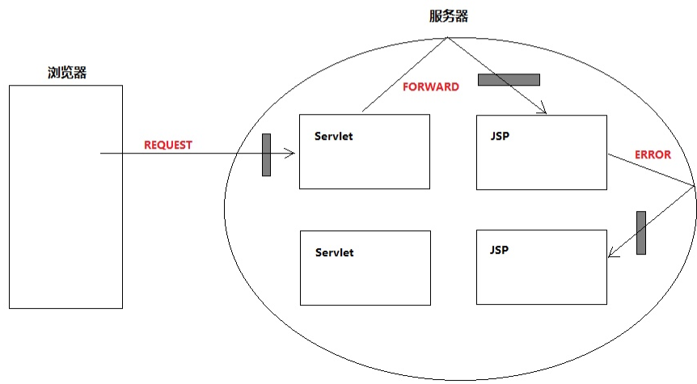
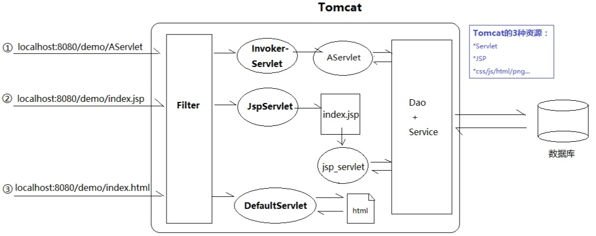
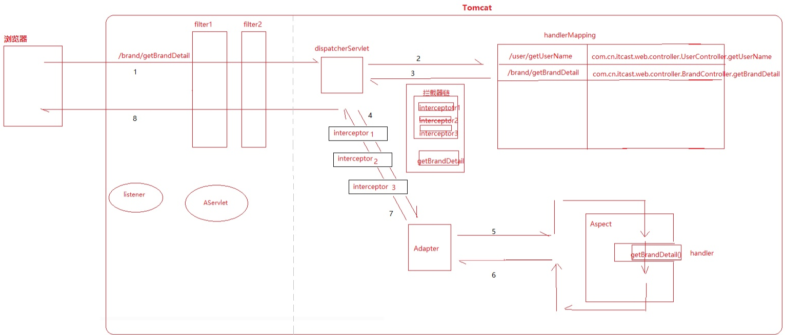
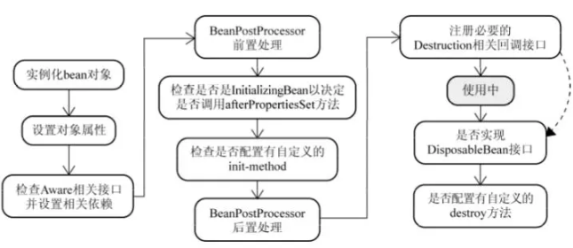
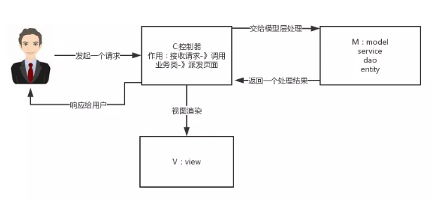

- 看过Spring的源码吗？
- IOC应用及原理
- AOP应用及原理
- 事务
- Spring涉及的设计模式
- 谈谈Spring Bean的生命周期和作用域
- Spring MVC的工作原理
- Spring vs Spring MVC
- Spring vs Spring Boot
- 了解微服务，Spring Cloud

# Servlet

servlet本身就是一个接口，它定义的是一套处理网络请求的规范，所有实现servlet的类，都需要实现它的五个方法。其中最主要的是两个生命周期方法init（）和destroy（），还有一个处理请求的service（）。

- 你初始化要做什么
- 你销毁时要做什么
- 你接收到请求时要做什么

**servlet本身不会跟客户端打交道，tomcat才是与客户端直接打交道的家伙**。它监听了端口，请求过来后，根据url信息确定要将请求交给哪个servlet去处理，然后调用servlet.service方法，service方法返回一个response对象，tomcat再把这个response对象返回给客户端。

**如何写一个Servlet？**

我们不需要实现javax.servlet接口，不用继承GenericServlet抽象类，**只需要继承HttpServlet并重写doGet（）/doPost等方法**。父类把能写的逻辑都已经写完，把不确定的业务代码抽成一个方法调用它。当子类重写该方法，整个业务代码就完整了。这就是模板方法模式。

## ServletContext

ServletContext，直译的话叫做“Servlet上下文”，听着挺别扭。它其实就是个大容器，是个map。服务器会为每个应用创建一个ServletContext对象：

- ServletContext对象的创建是在服务器启动时完成的
- ServletContext对象的销毁是在服务器关闭时完成的

ServletContext对象的作用是在整个Web应用的动态资源（Servlet/JSP）之间共享数据。例如在AServlet中向ServletContext对象保存一个值，然后在BServlet中就可以获取这个值。这种用来装载共享数据的对象，在JavaWeb中共有4个，而且更习惯被成为“**域对象**”：

- ServletContext域（Servlet间共享数据）
- Session域（一次会话间共享数据，也可以理解为多次请求间共享数据）
- Request域（同一次请求共享数据）
- Page域（JSP页面内共享数据）

**获取**ServletContext的方法共5种（page域这里不考虑，JSP太少用了）：

- ServletConfig#getServletContext();
- GenericServlet#getServletContext();
- HttpSession#getServletContext();
- HttpServletRequest#getServletContext();
- ServletContextEvent#getServletContext();

## Filter拦截方式

Filter可以设置4种拦截方式：REQUEST/FORWARD/INCLUDE/ERROR

Redirect和REQUEST/FORWARD/INCLUDE/ERROR最大区别在于：

- 重定向会导致浏览器发送**2**次请求，FORWARD们是服务器内部的**1**次请求

了解这个区别之后，我提一个很奇怪的问题：为什么这4种只引发1次请求？

> 因为FORWARD/INCLUDE等请求的分发是服务器内部的流程，不涉及浏览器

如何转发？


我们发现通过Request或者ServletContext都可以得到分发器Dispatcher，但由于ServletContext代表整个应用，我更倾向于认为：ServletContext拥有分发器，Request是找它借的。

分发器是干嘛的？分发请求：REQUEST/FORWARD/INCLUDE/ERROR。REQUEST是浏览器发起的，而ERROR是发生页面错误时发生的，稍微特殊些。

所以Filter更详细的拦截应该是这样的：



## Servlet映射器

所谓的映射器，其实是Tomcat中一个叫Mapper的类。它里面有个internalMapWrapper方法，定义其中映射规则。

- 对于静态资源，Tomcat最后会交由一个叫做DefaultServlet的类来处理
- 对于Servlet，Tomcat最后会交由一个叫做InvokerServlet的类来处理
- 对于JSP，JspServlet来处理



## DispatcherServlet



# IoC应用及原理

## IoC

IoC（Inverse of Control:控制反转）是一种**设计思想**，就是 **将原本在程序中手动创建对象的控制权，交由Spring框架来管理。**  IoC 在其他语言中也有应用，并非 Spirng 特有。 **IoC 容器是 Spring 用来实现 IoC 的载体，  IoC 容器实际上就是个Map（key，value）,Map 中存放的是各种对象。**

将对象之间的相互依赖关系交给 IOC 容器来管理，并由 IOC 容器完成对象的注入。这样可以很大程度上简化应用的开发，把应用从复杂的依赖关系中解放出来。  **IOC 容器就像是一个工厂一样，当我们需要创建一个对象的时候，只需要配置好配置文件/注解即可，完全不用考虑对象是如何被创建出来的。** 在实际项目中一个 Service 类可能有几百甚至上千个类作为它的底层，假如我们需要实例化这个 Service，你可能要每次都要搞清这个 Service 所有底层类的构造函数，这可能会把人逼疯。如果利用 IOC 的话，你只需要配置好，然后在需要的地方引用就行了，这大大增加了项目的可维护性且降低了开发难度。

Spring 时代我们一般通过 XML 文件来配置 Bean，后来开发人员觉得 XML 文件来配置不太好，于是 SpringBoot 注解配置就慢慢开始流行起来。

SpringIoC的初始化过程：

XML读取到Resource，解析BeanDefinition，然后注册BeanFactory。

## IoC vs DI

Inverse of Control 反转控制的概念，就是将原本在程序中手动创建UserService对象的控制权，交由Spring框架管理，简单说，就是创建UserService对象控制权被反转到了Spring框架。IoC容器实际上就是一个Map，Map中存放各种对象。

依赖注入（Dependency Inject）：在Spring框架负责创建Bean对象时，动态的将依赖对象注入到Bean组件

> IoC 和 DI的区别？
>
> IoC 控制反转，指将对象的创建权，反转到Spring容器 ， DI 依赖注入，指Spring创建对象的过程中，通过反射将对象依赖属性通过配置进行注入

# Spring Bean的生命周期和作用域

## Bean的生命周期



**1.bean定义**：在配置文件里面用<bean></bean>来进行定义

**2.bean初始化**

- 在配置文件中通过init-method属性来完成
- 实现org.springframwork.beans.factory.InitializingBean接口

**3.bean调用**

有三种方式可以得到bean实例，并调用

- 使用类构造器实例化 `<bean id="bean1" class="cn.itcast.spring.b_instance.Bean1"></bean>`

- 使用静态工厂方法实例化(简单工厂模式)：`<bean id="bean2" class="cn.itcast.spring.b_instance.Bean2Factory" factory-method="getBean2"></bean>`

- 使用实例工厂方法实例化(工厂方法模式)

  ```
  <bean id="bean3Factory" class="cn.itcast.spring.b_instance.Bean3Factory"></bean>
  <bean id="bean3" factory-bean="bean3Factory" factory-method="getBean3"></bean>
  ```
  
  - 如果 Bean 实现了 `BeanNameAware` 接口，调用 `setBeanName()`方法，传入Bean的名字。
  
  - 如果 Bean 实现了 `BeanClassLoaderAware` 接口，调用 `setBeanClassLoader()`方法，传入 `ClassLoader`对象的实例。
  - 如果Bean实现了 `BeanFactoryAware` 接口，调用 `setBeanClassLoader()`方法，传入 `ClassLoade` r对象的实例。
  - 与上面的类似，如果实现了其他 `*.Aware`接口，就调用相应的方法。
  - 如果有和加载这个 Bean 的 Spring 容器相关的 `BeanPostProcessor` 对象，执行`postProcessBeforeInitialization()` 方法
  - 如果Bean实现了`InitializingBean`接口，执行`afterPropertiesSet()`方法。
  - 如果 Bean 在配置文件中的定义包含  init-method 属性，执行指定的方法。
  - 如果有和加载这个 Bean的 Spring 容器相关的 `BeanPostProcessor` 对象，执行`postProcessAfterInitialization()` 方法

**4.bean销毁**

- 使用配置属性指定的destroy-method属性，执行相应的destroy（）方法
- 实现org.springframwork.bean.factory.DisposeableBean接口，执行destroy方法

## 作用域

**singleton**：Spring IoC容器中只能存在一个共享的bean实例，并且所有对bean的请求，只要与该bean相匹配。则只会返回bean的同一实例

**prototype**：Prototype作用域的bean会导致在每次对该bean请求（将其注入到另一个bean中，或者以程序的方式调用容器的getBean()方法）时都会创建一个新的bean实例。根据经验，对于所有有状态的bean应该使用prototype，而没有状态的则使用singleton。

**request**：在一次HTTP请求中，一个bean定义对应一个实例，即每次http请求将会有各自的bean实例，它们根据某个bean定义创建而成。该作用域仅在基于web的SpringApplicationContext情形下有效。

**seesion**：在一个HttpSession中，一个bean定义对应一个实例。和上述request相同，只能适用于基于Web的SpringApplicationContext

**global session**：在一个全局的HttpSession中，一个bean定义对应一个实例。只能适用于基于Web的SpringApplicationContext

## Spring中的单例Bean的线程安全问题

主要是因为多个线程操作同一个对象的时候，对这个对象的非静态成员变量的写操作会存在线程安全问题；

常见的有两种解决办法：

1. 在Bean对象中尽量避免定义可变的成员变量
2. 在类中定义一个**ThreadLocal**成员变量，将需要的可变成员变量保存在ThreadLocal中

# AOP

aop面向切面编程能够将那些与业务无关，却为业务模块所共同调用的逻辑或者责任（事务处理、日志管理、权限控制等）封装起来，便于减少系统的重复代码，降低模块间的耦合度，并有利于未来的可拓展性和可维护性。

SpringAop就是基于动态代理的，如果要代理的对象，实现了某个接口，那么springAop会使用JDK proxy，去创建代理对象。而对于没有实现接口的对象，就无法使用JDK Proxy去进行代理，这个时候会使用Cglib生成一个被代理的子类来作为代理。

使用 AOP 之后我们可以把一些通用功能抽象出来，在需要用到的地方直接使用即可，这样大大简化了代码量。我们需要增加新功能时也方便，这样也提高了系统扩展性。日志功能、事务管理等等场景都用到了 AOP 。

## Spring  AOP和AspectJ AOP有什么区别？

**Spring AOP属于运行时增强，而AspectJ是编译时增强**。Spring AOP 基于代理(Proxying)，而 AspectJ 基于字节码操作(Bytecode Manipulation)。

Spring AOP 已经集成了 AspectJ  ，AspectJ  应该算的上是 Java 生态系统中最完整的 AOP 框架了。AspectJ  相比于 Spring AOP 功能更加强大，但是 Spring AOP 相对来说更简单，

**速度方面**：如果我们的切面比较少，那么两者性能差异不大。但是，当切面太多的话，最好选择 AspectJ ，它比Spring AOP 快很多。

# Spring事务

事务就是对一系列的数据库操作进行统一的提交或者回滚操作。如果插入成功，那么一起成功。如果中间有一条数据出现异常，那么回滚之前的所有操作。防止出现脏数据，防止数据库出现问题。  

为了避免这种情况，Spring也有自己的事务管理机制，一般使用TransactionMananger进行管理，可以通过Spring注入来完成此功能。提供了几个关于事务处理的类：

- TransactionDefinition //事务属性定义(事务隔离级别、传播行为、超时、只读、回滚规则)
- TransactionStatus //事务的运行状态，可以提交，回滚
- PlatformTransactionManager这个是spring提供的用于管理事务的基础接口，其下有一个实现的抽象类AbstractPlatformTransactionManager。我们使用的事务管理类例如DataSourceTransactionManager等都是这个类的子类

Spring并不直接管理事务，而是提供了多种事务管理器，他们讲事务管理的职责委托给Hibernate或者JTA等持久化机制所提供的相关平台框架的事务来实现。Spring事务管理器的接口是：org.springframework.transaction.PlatformTransactionManager，通过这个接口，Spring为各个平台如JDBC、Hibernate等都提供了对应的事务管理器，具体的实现是各个平台完成的。


**事务定义步骤：**

~~~java
TransactionDefinition td =newTransactionDefinition();
TransactionStatus ts = transactionManager.getTransaction(td);
try{ 
    //do sth
    transactionManager.commit(ts);
}catch(Exception e){
    transactionManager.rollback(ts);
}
~~~

Spring提供的**事务管理**可以分为两类：编程式和声明式。编程式比较灵活，但是代码量大，存在重复的代码；而声明式的比编程的更灵活。

~~~java
//编程式主要使用transactionTemplate
void add(){
    transactionTemplate.execute(newTransactionCallback(){
        pulic Object doInTransaction(TransactionStatus ts){
         //do sth
        }
    }
}
~~~

声明式事务：

使用TransactionProxyFactoryBean（org.springframework.transaction.interceptor.TransactionProxyFactoryBean）

> PROPAGATION_REQUIRED 
>
> PROPAGATION_REQUIRED 
>
> PROPAGATION_REQUIRED
>
> readOnly

围绕Poxy的动态代理，能够自动的提交和回滚事务

PROPAGATION_REQUIRED–支持当前事务，如果当前没有事务，就新建一个事务。这是最常见的选择。

PROPAGATION_SUPPORTS–支持当前事务，如果当前没有事务，就以非事务方式执行。

PROPAGATION_MANDATORY–支持当前事务，如果当前没有事务，就抛出异常。

PROPAGATION_REQUIRES_NEW–新建事务，如果当前存在事务，把当前事务挂起。

PROPAGATION_NOT_SUPPORTED–以非事务方式执行操作，如果当前存在事务，就把当前事务挂起。

PROPAGATION_NEVER–以非事务方式执行，如果当前存在事务，则抛出异常。

PROPAGATION_NESTED–如果当前存在事务，则在嵌套事务内执行。如果当前没有事务，则进行与PROPAGATION_REQUIRED类似的操作。

# Spring中的设计模式

## 控制反转和依赖注入

IoC是Spring中的一个非常重要的概念，是一种解耦的设计思想。它的主要目的是借助于“第三方”（IoC容器）实现具有依赖关系对象之间的解耦，来降低代码之间的耦合度。

IoC是一种设计思想，而不是一个设计模式，**Service Locator、Fatory、Abstract Factory、Template Method、Strategy、Dependency Injection**等设计模式使用了IoC设计思想。

## 1.工厂设计模式

Spring中使用工厂模式可以通过BeanFactory或ApplicationContext创建Bean对象

两者对比：

- BeanFactory：延迟注入（使用到某个Bean的时候才会注入），占用更少的内存，程序启动速度也会更快
- ApplicationContext：容器启动的时候，不管你有没有用到，一次性创建所有的Bean。BeanFactory提供了最基本的依赖注入支持，ApplicationContext扩展了BeanFatory，除了有BeanFactory的功能还有额外很多功能，所有一般开发人员使用ApplicationContext会更多。

ApplicationContext的三个实现类：

- ClassPathXmlApplication：把上下文件当成类路径资源
- `FileSystemXmlApplication`：从文件系统中的 XML 文件载入上下文定义信息
- `XmlWebApplicationContext`：从Web系统中的XML文件载入上下文定义信息。

~~~java
import org.springframework.context.ApplicationContext;
import org.springframework.context.support.FileSystemXmlApplicationContext;

public class App {
    public static void main(String[] args) {
        ApplicationContext context = new FileSystemXmlApplicationContext(
                "C:/work/IOC Containers/springframework.applicationcontext/src/main/resources/bean-factory-config.xml");

        HelloApplicationContext obj = (HelloApplicationContext) context.getBean("helloApplicationContext");
        obj.getMsg();
    }
}
~~~

## 2.单例设计模式

有一些对象我们只需要一个，例如线程池、缓存、对话框、注册表、日志表、充当打印机显卡等设备驱动程序的对象等。

**使用单例模式带来的好处**：

- 对于频繁使用的对象，可以省略创建对象所花费的时间，这对于那些重量级对象而言，是一个非常可观的开销。
- 由于new操作的次数减少，这可以减轻GC压力，缩短GC停顿时间。

**Spring中bean的默认作用域就是单例模式**。

**Spring中使用单例的方式：**

- xml：<bean id="userService" class="top.snailclimb.UserService" scope="singleton"/>
- 注解：`@Scope(value = "singleton")`

**Spring实现单例的原理**：通过`CocurrentHashMap`实现单例注册表的特殊方式实现单例模式。Spring实现单例的核心代码如下：

~~~java

// 通过 ConcurrentHashMap（线程安全） 实现单例注册表
private final Map<String, Object> singletonObjects = new ConcurrentHashMap<String, Object>(64);

public Object getSingleton(String beanName, ObjectFactory<?> singletonFactory) {
        Assert.notNull(beanName, "'beanName' must not be null");
        synchronized (this.singletonObjects) {
            // 检查缓存中是否存在实例  
            Object singletonObject = this.singletonObjects.get(beanName);
            if (singletonObject == null) {
                //...省略了很多代码
                try {
                    singletonObject = singletonFactory.getObject();
                }
                //...省略了很多代码
                // 如果实例对象在不存在，我们注册到单例注册表中。
                addSingleton(beanName, singletonObject);
            }
            return (singletonObject != NULL_OBJECT ? singletonObject : null);
        }
    }
    //将对象添加到单例注册表
    protected void addSingleton(String beanName, Object singletonObject) {
            synchronized (this.singletonObjects) {
                this.singletonObjects.put(beanName, (singletonObject != null ? singletonObject : NULL_OBJECT));

            }
        }
}
~~~

## 3.代理设计模式

代理设计模式在Spring中一个重要应用就是**AOP**！

## 4.模板方法

模板方法模式是一种行为设计模式，它定义一个操作中的算法的骨架，而将一些步骤延迟到子类中。 模板方法使得子类可以不改变一个算法的结构即可重定义该算法的某些特定步骤的实现方式。

~~~java
public abstract class Template {
    //这是我们的模板方法
    public final void TemplateMethod(){
        PrimitiveOperation1();  
        PrimitiveOperation2();
        PrimitiveOperation3();
    }

    protected void  PrimitiveOperation1(){
        //当前类实现
    }

    //被子类实现的方法
    protected abstract void PrimitiveOperation2();
    protected abstract void PrimitiveOperation3();

}
public class TemplateImpl extends Template {

    @Override
    public void PrimitiveOperation2() {
        //当前类实现
    }

    @Override
    public void PrimitiveOperation3() {
        //当前类实现
    }
}
~~~

Spring中jdbcTemplate、hibernateTemplate等以Template结尾的对数据库操作的类，他们就使用了模板模式。一般情况下，我们都是使用继承的方式来实现模板方式，但是Spring中并没有使用这种方式，而是使用Callback模式与模板方法模式配合，既达到代码复用的效果，同时增加了灵活性。

## 5.观察者模式

观察者模式是一种对象行为型模式，它表示的是一种对象与对象之间具有依赖关系，当一个对象发生改变的时候，这个对象所依赖的对象也会做出反应。Spring 事件驱动模型就是观察者模式很经典的一个应用。**Spring 事件驱动模型**非常有用，在很多场景都可以解耦我们的代码。比如我们每次添加商品的时候都需要重新更新商品索引，这个时候就可以利用观察者模式来解决这个问题。

**Spring事件驱动模型中的三种角色**

1. 事件角色

   `ApplicationEvent` (`org.springframework.context`包下)充当事件的角色,这是一个抽象类，它继承了`java.util.EventObject`并实现了 `java.io.Serializable`接口。

   Spring 中默认存在以下事件，他们都是对 `ApplicationContextEvent` 的实现(继承自`ApplicationContextEvent`)：

   - `ContextStartedEvent`：`ApplicationContext` 启动后触发的事件;
   - `ContextStoppedEvent`：`ApplicationContext` 停止后触发的事件;
   - `ContextRefreshedEvent`：`ApplicationContext` 初始化或刷新完成后触发的事件;
   - `ContextClosedEvent`：`ApplicationContext` 关闭后触发的事件

2. 事件监听者角色

   `ApplicationListener` 充当了事件监听者角色，它是一个接口，里面只定义了一个`onApplicationEvent（）`方法来处理`ApplicationEvent`。`ApplicationListener`接口类源码如下，可以看出接口定义看出接口中的事件只要实现了 `ApplicationEvent`就可以了。所以，在 Spring中我们只要实现 `ApplicationListener` 接口实现 `onApplicationEvent()` 方法即可完成监听事件

   ~~~java
   package org.springframework.context;
   import java.util.EventListener;
   @FunctionalInterface
   public interface ApplicationListener<E extends ApplicationEvent> extends EventListener {
       void onApplicationEvent(E var1);
   }
   ~~~

3. 事件发布者角色

   `ApplicationEventPublisher` 充当了事件的发布者，它也是一个接口。

   ```java
   @FunctionalInterface
   public interface ApplicationEventPublisher {    
       default void publishEvent(ApplicationEvent event) {                       
           this.publishEvent((Object)event);    
       }    
       void publishEvent(Object var1);
   }
   ```

   `ApplicationEventPublisher` 接口的`publishEvent（）`这个方法在`AbstractApplicationContext`类中被实现，阅读这个方法的实现，你会发现实际上事件真正是通过`ApplicationEventMulticaster`来广播出去的。

**Spring的事件流程总结**

1. 定义一个事件: 实现一个继承自 `ApplicationEvent`，并且写相应的构造函数；
2. 定义一个事件监听者：实现 `ApplicationListener` 接口，重写 `onApplicationEvent()` 方法；
3. 使用事件发布者发布消息: 可以通过 `ApplicationEventPublisher` 的 `publishEvent()` 方法发布消息。

~~~java
// 定义一个事件,继承自ApplicationEvent并且写相应的构造函数
public class DemoEvent extends ApplicationEvent{
    private static final long serialVersionUID = 1L;

    private String message;

    public DemoEvent(Object source,String message){
        super(source);
        this.message = message;
    }

    public String getMessage() {
         return message;
          }


// 定义一个事件监听者,实现ApplicationListener接口，重写 onApplicationEvent() 方法；
@Component
public class DemoListener implements ApplicationListener<DemoEvent>{

    //使用onApplicationEvent接收消息
    @Override
    public void onApplicationEvent(DemoEvent event) {
        String msg = event.getMessage();
        System.out.println("接收到的信息是："+msg);
    }

}
// 发布事件，可以通过ApplicationEventPublisher  的 publishEvent() 方法发布消息。
@Component
public class DemoPublisher {

    @Autowired
    ApplicationContext applicationContext;

    public void publish(String message){
        //发布事件
        applicationContext.publishEvent(new DemoEvent(this, message));
    }
}
~~~

## 6.适配器模式

适配器模式将一个接口转换成客户希望的另一个接口，适配器模式使接口不兼容的那些类可以一起工作，其别名为包装器Wrapper

**Spring AOP中的适配器模式**：

SpringAop的实现是基于代理模式的，但是SpringAOP的增强或者通知使用了适配器模式，与之相关的接口是AdvisorAdapter。Advice常用的类型有：BeforeAdvice（目标方法调用前，前置通知）、AfterAdvice、AfterReturningAdvice。每个类型Advice（通知）都有对应的拦截器：`MethodBeforeAdviceInterceptor`、`AfterReturningAdviceAdapter`、`AfterReturningAdviceInterceptor`。Spring预定义的通知要通过对应的适配器，适配成 `MethodInterceptor`接口(方法拦截器)类型的对象（如：`MethodBeforeAdviceInterceptor` 负责适配 `MethodBeforeAdvice`）。

**SpringMVC的适配器模式**：

在Spring MVC中，`DispatcherServlet` 根据请求信息调用 `HandlerMapping`，解析请求对应的 `Handler`。解析到对应的 `Handler`（也就是我们平常说的 `Controller` 控制器）后，开始由`HandlerAdapter` 适配器处理。`HandlerAdapter` 作为期望接口，具体的适配器实现类用于对目标类进行适配，`Controller` 作为需要适配的类。

**为什么要在 Spring MVC 中使用适配器模式？** Spring MVC 中的 `Controller` 种类众多，不同类型的 `Controller` 通过不同的方法来对请求进行处理。如果不利用适配器模式的话，`DispatcherServlet` 直接获取对应类型的 `Controller`，需要的自行来判断，像下面这段代码一样：

```java
 if(mappedHandler.getHandler() instanceof MultiActionController){  
   ((MultiActionController)mappedHandler.getHandler()).xxx  
}else if(mappedHandler.getHandler() instanceof XXX){  
    ...  
}else if(...){  
   ...  
}  
```

假如我们再增加一个 `Controller`类型就要在上面代码中再加入一行 判断语句，这种形式就使得程序难以维护，也违反了设计模式中的开闭原则 – 对扩展开放，对修改关闭。

## 7.装饰者模式

装饰者模式可以动态地给对象添加一些额外的属性或行为。相比于使用继承，装饰者模式更加灵活。简单点儿说就是当我们需要修改原有的功能，但我们又不愿直接去修改原有的代码时，设计一个Decorator套在原有代码外面。其实在 JDK 中就有很多地方用到了装饰者模式，比如 `InputStream`家族，`InputStream` 类下有 `FileInputStream` (读取文件)、`BufferedInputStream` (增加缓存,使读取文件速度大大提升)等子类都在不修改`InputStream` 代码的情况下扩展了它的功能。

Spring 中配置 DataSource 的时候，DataSource 可能是不同的数据库和数据源。我们能否根据客户的需求在少修改原有类的代码下动态切换不同的数据源？Spring 中用到的包装器模式在类名上含有 `Wrapper`或者 `Decorator`。这些类基本上都是动态地给一个对象添加一些额外的职责

# Spring MVC原理

## 简单介绍

**Model1 时代** : 很多学 Java 后端比较晚的朋友可能并没有接触过  Model1 模式下的 JavaWeb 应用开发。在 Model1 模式下，整个 Web 应用几乎全部用 JSP 页面组成，只用少量的 JavaBean 来处理数据库连接、访问等操作。这个模式下 JSP 即是控制层又是表现层。显而易见，这种模式存在很多问题。比如①将控制逻辑和表现逻辑混杂在一起，导致代码重用率极低；②前端和后端相互依赖，难以进行测试并且开发效率极低；

**Model2 时代** ：学过 Servlet 并做过相关 Demo 的朋友应该了解“Java Bean(Model)+ JSP（View,）+Servlet（Controller）  ”这种开发模式,这就是早期的 JavaWeb MVC 开发模式。Model:系统涉及的数据，也就是 dao 和 bean。View：展示模型中的数据，只是用来展示。Controller：处理用户请求都发送给 ，返回数据给 JSP 并展示给用户。



简单介绍：SpringMVC框架以请求为驱动，围绕Servlet设计，将请求发给控制器，然后通过模型对象，分派器来展示请求结果视图。其中核心类DispatcherServlet，它是一个Servlet，顶层是实现的Servlet接口。

## 工作原理

1. 客户端浏览器发送请求，直接请求到DispatchServlet
2. DispatchServlet根据请求信息调用HandlerMapping，解析请求对应的Handler
3. 解析到对应的Handler（Controller控制器）后，开始由HandlerAdapter适配器来处理
4. HandlerAdapter会根据Handler来调用真正的处理器来处理请求，并处理相应的业务逻辑
5. 处理器处理完成后，会返回一个ModelAndView对象。Model返回的数据对象，View是个逻辑上的View
6. ViewResolver会根据逻辑View查找实际的View
7. DispatchServlet把返回的Model传给View（视图渲染）。
8. 把View返回给请求者

## 重要组件说明

**1.前端控制器DispatchServlet，不需要开发，由框架提供**

作为SpringMVC的入口函数。接受请求，响应结果，相当于转发器，中央处理器。有了DispatchServlet减少了其他组件之间的耦合度。用户请求到达前端控制器，他就相当于MVC中的C，DispatchServlet是整个流程控制的中心，由他调用其他组件处理用户的请求。

**2.处理器映射器HandleMapping，有框架提供**

根据请求的url查找Handler。HandlerMapping负责根据用户请求找到Handler即处理器Controller，SpringMVC提供了不同的映射器出现不同的映射方式，例如：配置文件方式、实现接口方式、注解方式

**3.处理适配器HandlerAdapter**

按照特定规则（HandlerAdapter要求的规则）去执行Handler。通过HandlerAdapter对处理器进行执行，这是适配器模式的应用，通过扩展适配器可以对更多的处理器进行执行。

**4.处理器Handler**

编写Handler时按照HandlerAdapter的要求去做，这样适配器才可以正确执行Handler。

Handler是继DispatcherServlet前端控制器的后端控制器，在DispatcherServlet的控制下Handler对具体的用户请求进行处理。由于Handler涉及到用户的业务请求，所以一般情况需要工程师根据业务需要来开发Handler

**5.视图解析器View resolver，不需要工程开发，由框架提供**

进行视图解析，根据逻辑视图名解析成真正的视图。

View Resolver首先根据逻辑视图名解析成物理视图即具体的页面地址，再生成View视图对象，最后对View进行渲染将处理结果通过页面展示给用户。Spring MVC提供了很多View视图类型，例如jstlView、freemarkerView、pdfView等。一般情况下需要通过页面标签或者页面模板技术将模型数据通过页面展示给用户，需要由工程师根据业务需求开发具体的页面

## 源码

DispatcherServlet类中属性Beans：

- HandlerMapping：用于Handler映射请求和一系列的对于拦截器的前处理和后处理，大部分用@Controller
- HandlerAdapter：帮助DispatcherServlet处理映射请求处理程序的适配器，而不用考虑实际调用的是哪个程序。
- ViewResolver：根据实际配置解析实际的View类型
- ThemeResolver：解决Web应用程序可以使用的主题，例如提供个性化布局。
- MultipartResolver：解析多部分请求，以支持从HTML表单上传文件。
- FlashMapManger：存储并检索可用于将一个请求属性传递到另一个请求的input和output的FlashMap，通常用于重定向。

# Spring

Spring是一个应用程序开发框架，提供了一个简易的开发方式。由框架来帮你管理对象，来降低代码之间耦合度。初次之外，Spring还有AOP、JDBC、MVC、Test、ORM、JMS等功能。另外基于Spring，你可以方便的与其他框架进行集成，如hibernate、ibatis等。它主要专注于让你的项目代码组织更为优雅，使其更具有极好的灵活性和扩展性，同时又能通过Spring集成业界优秀的解决方案。

# Spring vs Spring Boot

初期的Spring通过代码加配置的形式为项目提供了良好的灵活性和扩展性，但随着Spring越来越庞大，其配置文件也越来越繁琐。大家渐渐觉得Spring那一套太过繁琐，此时，Spring社区推出了Spring Boot，它的目的在于**实现自动配置，降低项目搭建的复杂度**，如需要搭建一个接口服务，通过Spring Boot，几行代码即可实现。可以理解为SpringBoot是基于Spring的一套快速开发整合包。通过设计大量的自动化配置等方式来简化Spring原有样板化的配置，让我们更加容易的使用Spring框架。

# Spring vs Spring MVC

Spring MVC是Spring的一部分，Spring 出来以后，大家觉得很好用，于是按照这种模式设计了一个 MVC框架（一些用Spring 解耦的组件），**主要用于开发WEB应用和网络接口，它是Spring的一个模块，通过Dispatcher Servlet, ModelAndView 和 View Resolver，让应用开发变得很容易**。

Spring MVC框架解决的核心问题是什么 Spring MVC框架提供了开发Web应用的分离方式。通过DispatcherServlet、ModelAndView、View Resolver等简单概念，使Web应用开发变得更加简单。

# Spring Cloud

SpringCloud是一个基于springBoot实现的微服务架构开发工具。它为微服务架构中设计的配置管理、服务治理、断路器、智能路由、微代理、控制总线、全局锁、决策竞选、分布式会话和集群状态管理等操作提供了一种简单的开发方式。

**通过一个业务场景来介绍Spring Cloud的核心组件**

假设咱们现在开发一个电商网站，要实现支付订单的功能，流程如下：

- 创建一个订单后，如果用户立刻支付了这个订单，我们需要将订单状态更新为“已支付”
- 扣减相应的商品库存
- 通知仓储中心，进行发货
- 给用户的这次购物增加相应的积分

针对上述流程，**我们需要有订单服务、库存服务、仓储服务、积分服务**。整个流程的大体思路如下：

- 用户针对一个订单完成支付之后，就会去找订单服务，更新订单状态
- 订单服务调用库存服务，完成相应功能
- 订单服务调用仓储服务，完成相应功能
- 订单服务调用积分服务，完成相应功能

**Eureka**：各个服务启动时，Eureka Client都会将服务注册到Eureka Server，并且Eureka Client还可以反过来从Eureka Server拉取注册表，从而知道其他服务在哪里

**Ribbon**：服务间发起请求的时候，基于Ribbon做负载均衡，从一个服务的多台机器中选择一台

**Feign**：基于Feign的动态代理机制，根据注解和选择的机器，拼接请求URL地址，发起请求

**Hystrix**：发起请求是通过Hystrix的线程池来走的，不同的服务走不同的线程池，实现了不同服务调用的隔离，避免了服务雪崩的问题

**Zuul**：如果前端、移动端要调用后端系统，统一从Zuul网关进入，由Zuul网关转发请求给对应的服务

## 参考网站

[拜托！面试请不要再问我Spring Cloud底层原理](https://juejin.im/post/5be13b83f265da6116393fc7#heading-7)